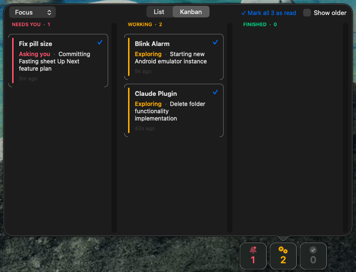
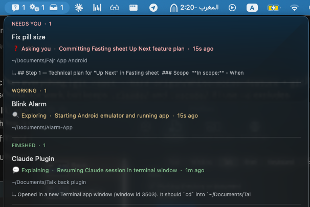
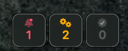
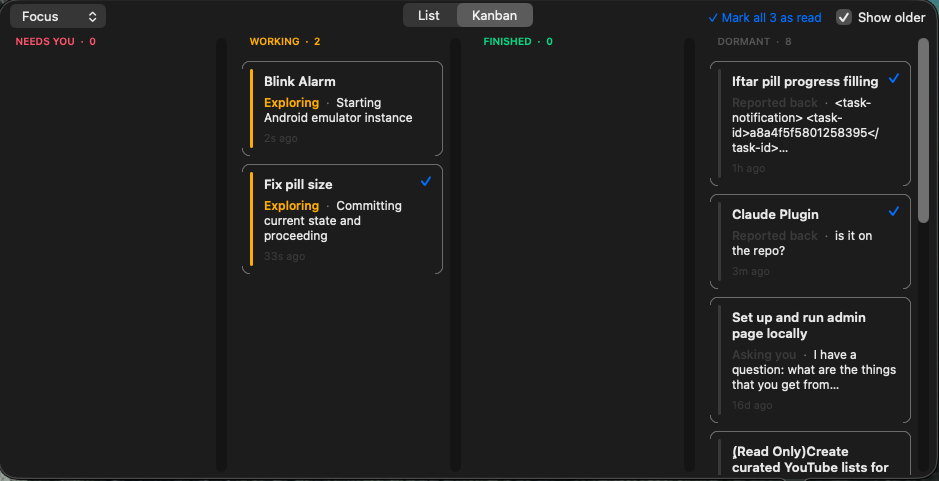
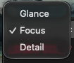
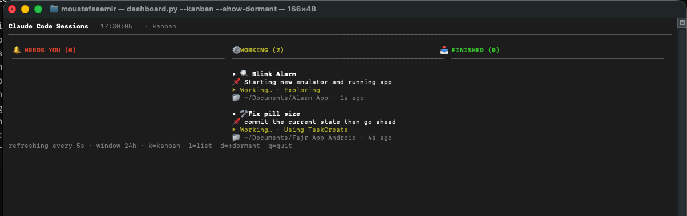

# claude-sessions-status

<p>
  <a href="LICENSE"></a>
  
  
  
</p>

> **A glance at every Claude Code session you've got running** — in your menu bar, in a floating glass capsule, or in a full terminal dashboard.

When you're driving several Claude Code sessions in parallel, it's easy to lose track of which one is asking you a question, which one is still working, and which ones have been silently waiting for an hour. `claude-sessions-status` watches Claude's local transcript files and surfaces the state of all your sessions in one of four ways:

- 🔔 **Menu bar plugin** — three live counts in your top-right, click for a grouped dropdown
- 🟢 **Floating glass badge** — a small always-on-top capsule, click to expand an attached popover (list or kanban, 3 density modes, click any session to jump to it)
- 🪟 **Always-on-top panel** — a draggable, resizable window that stays in front, list or kanban
- 🖥 **Terminal dashboard** — a full-screen grouped view for triage and planning, list or kanban, live hotkeys

No daemon, no Anthropic API key required, no plugins to register inside Claude. Pure Python + AppKit, ~stdlib-only.



---

## 🚀 Quick start

```bash
curl -fsSL https://raw.githubusercontent.com/blink22/claude-sessions-status/main/install.sh | bash
```

That's it. The installer clones the repo to `~/.claude-sessions-status/`, symlinks entry points into `~/.local/bin/`, then runs the interactive setup — which wires up SwiftBar (the menu bar host), optionally prompts for an Anthropic API key to enable AI gists, and offers to add SwiftBar to macOS Login Items so the menu bar persists across reboots.

Then pick your favourite view:

```bash
claude-sessions-status badge              # small floating glass capsule + popover
claude-sessions-status panel              # always-on-top window
claude-sessions-status panel --kanban     # …in 3-column kanban layout
claude-sessions-status-dashboard          # full-screen terminal
claude-sessions-status-dashboard --kanban # terminal in 3-column kanban
```

---

## Why this exists

Claude Code shines at parallelism — kick off multiple sessions on different projects, switch between them, let them work. The pain point is context-switching:

- Did Claude ask me a question, or is it still working?
- Of these 5 sessions, which 2 are actually blocked on me?
- I started a session in the kitchen 2 hours ago. Did it finish?
- Which sessions are live, and which did I forget about?

There was no built-in dashboard for this. So this is one. It reads Claude's transcript files and Claude for Desktop's session metadata directly — no API account required to *run*, no plugins to register inside Claude, no daemon process.

---

## What it shows

Sessions are grouped into four buckets by what they need from you:

| Bucket | Meaning |
|---|---|
| 🔔 **NEEDS YOU** | Claude asked a direct question (`AskUserQuestion`), proposed a plan (`ExitPlanMode`), or got stuck (no real progress for > 5 min while working). |
| ⚙️ **WORKING** | Claude is actively running tools, coding, exploring — hands off. |
| 📥 **FINISHED** | Claude finished its turn and is waiting for your reply. |
| 💤 **DORMANT** | Stale session (no real activity for > 30 min, or the Claude process has exited). Listed compactly at the bottom in dim text. |

Each session row tells you:

```
Build audio plugin for Claude responses
🛠 Coding · Fixing bottom sheet padding bug · 2s ago
~/Documents/<project>
```

- **Title** — your custom session title from Claude for Desktop (falls back to the first user prompt if you haven't set one).
- **Status line** — phase icon + phase + AI-generated task gist + age.
- **Folder** — the project's `cwd`. Clickable to open in Finder.
- For FINISHED / NEEDS YOU rows, a fourth line shows a literal preview of the most recent output.

---

## Four ways to view sessions

### 1. Menu bar plugin (SwiftBar)

The default. Once installed and SwiftBar is running, your menu bar shows three small icons with counts:

```
:bell.badge.fill: 1   :gearshape.2.fill: 2   :tray.fill: 2
```

Click the menu bar item to drop down a list of all active sessions grouped by bucket.



### 2. Floating glass badge + popover

A small always-on-top capsule (~150×36px) you can park anywhere on your desktop. Three tinted numerals (red / amber / green) with rounded underline accents, frosted-glass background via `NSVisualEffectView`. Click it and a native macOS popover slides out **attached to the badge** — with an arrow pointing back at it — listing your sessions in a rich per-row layout.

```bash
claude-sessions-status badge
```

Anatomy of the badge:

```
   ┌──────────────────────────────┐
   │                              │
   │   1         2         2      │   ← P3-tinted SF Pro Rounded
   │   ─         ─         ─      │   ← 2pt rounded underline accents
   │                              │
   └──────────────────────────────┘
        red      amber     green
       NEEDS    WORKING   FINISHED
```



The badge is visible on every Space, including alongside full-screen apps (it uses `NSWindowCollectionBehavior` flags `canJoinAllSpaces | stationary | fullScreenAuxiliary`). Drag it anywhere on screen — its position is remembered across launches.

**Inside the popover:**

- **Density popup (top-left)** — `Glance` / `Focus` / `Detail`. Glance is one line per session (title only), Focus is the standard 4-line card, Detail adds a richer assistant-follow-on summary. Your choice is persisted across launches.
- **List ↔ Kanban toggle (top-bar segmented control)** — flip between a vertical list and a 3-column kanban (`NEEDS YOU` / `WORKING` / `FINISHED`). The popover auto-resizes between the two layouts.
- **Show Older checkbox** — adds a 4th `DORMANT` column on the right of the kanban (not under FINISHED) for sessions you've drifted away from. See the screenshot below for what this looks like with several dormant sessions.


- **"✓ Mark all N as read" button (top-right in kanban)** — clears the unread indicator on NEEDS-YOU cards you've already glanced at. Acknowledgements persist in `~/.claude-sessions-status-seen.json`.
- **Click any card / list row** to jump straight to that Claude Code session — we focus the existing Terminal tab if the session is live, or spawn a new tab running `claude --resume <session-id>` if not.
- **First click is honored** — clicking inside an inactive popover counts as a real click on the card, no double-clicking required.



The density picker (top-left corner of the popover) lets you tune how much information each session card shows — from a single title line (Glance) up to a rich 4-line card with phase, task gist, folder, and assistant preview (Detail).

Built with PyObjC + AppKit; anchored via `NSPopover` so the expanded view stays visually tied to the badge.

### 3. Always-on-top panel

A standalone window pinned in front of everything else — same data and layout as the popover, but in a draggable, resizable window of its own. Useful if you want the dashboard visible permanently in a corner of the screen without the click-to-expand step.

```bash
claude-sessions-status panel              # list mode (default)
claude-sessions-status panel --kanban     # 3-column kanban
claude-sessions-status panel --quit       # quit a running panel/badge
```

The panel and the badge share state (popover mode, density, mark-as-read acknowledgements) — switching density or view in one updates the other on next refresh.

### 4. Terminal dashboard

A full-screen grouped view, refreshing every 5 seconds. Useful for triage, or for parking in a side terminal window during a working session. Supports the same kanban layout as the GUI views.

```bash
claude-sessions-status-dashboard                    # list (default)
claude-sessions-status-dashboard --kanban           # 3-column kanban
claude-sessions-status-dashboard --kanban --save    # remember --kanban for next launch
claude-sessions-status-dashboard --show-dormant     # include the dormant column / sessions
```

**Live hotkeys while running** (no need to restart):

| Key | Action |
|---|---|
| `k` | Switch to kanban view (auto-persists) |
| `l` | Switch to list view (auto-persists) |
| `d` | Toggle the dormant column / dormant sessions |
| `r` | Force an immediate refresh |
| `q` | Quit |
| `1`–`9` | Resume the Nth visible session in a new Terminal window (`claude --resume <session-id>`) |

Mode persists to `~/.claude-sessions-status-dashboard-mode`, independent of the badge/popover preference — so you can have the GUI in list mode and the terminal in kanban (or vice versa) without them stomping on each other.



If the terminal is narrower than ~60 columns, the dashboard falls back to list view with a small banner — kanban needs the horizontal room to be useful.

---

## Install

### Option A — Shell installer (recommended)

```bash
curl -fsSL https://raw.githubusercontent.com/blink22/claude-sessions-status/main/install.sh | bash
```

What it does:
1. Pre-flight checks (macOS, `git`, Python ≥ 3.9).
2. `git clone` the repo to `~/.claude-sessions-status/` (or `git pull` if it already exists).
3. Symlinks two entry points into `~/.local/bin/`:
   - `claude-sessions-status`
   - `claude-sessions-status-dashboard`
4. Warns if `~/.local/bin` isn't on `PATH` and prints the exact line to add to `~/.zshrc`.
5. Hands off to the interactive setup (`claude-sessions-status install`), which handles SwiftBar, the env file, and Login Items.

To pin a specific version instead of `main`:

```bash
CSS_REF=v0.2.0 bash <(curl -fsSL https://raw.githubusercontent.com/blink22/claude-sessions-status/main/install.sh)
```

To upgrade later: re-run the same one-liner. It detects the existing checkout and does a `git pull`.

### Option B — Homebrew (coming soon)

A Homebrew formula exists in [`Formula/claude-sessions-status.rb`](https://github.com/blink22/homebrew-claude-sessions-status/blob/main/Formula/claude-sessions-status.rb) but the tap repo isn't published yet. Once it is, install will be:

```bash
brew install blink22/claude-sessions-status/claude-sessions-status
claude-sessions-status install
```

In the meantime, use Option A.

### Option C — Developer install (clone + edit)

For users who want to modify the Python code. After this, edits take effect on the next SwiftBar tick — no rebuild, no reinstall.

```bash
git clone https://github.com/Blink22/claude-sessions-status ~/code/claude-sessions-status
cd ~/code/claude-sessions-status
./scripts/install.py setup --from-source
```

The `--from-source` flag symlinks SwiftBar to **your local checkout** (not the system prefix) and writes a marker at `~/.claude-sessions-status-source` so `doctor` reports it as a dev install.

---

## What the installer does

The `install` subcommand walks through:

1. Checks SwiftBar — installs it via Homebrew if missing (prompts first).
2. Asks for an `ANTHROPIC_API_KEY` (optional — skip = free heuristic mode).
3. Writes `~/.claude-sessions-status.env` with `chmod 600`.
4. Symlinks `menubar.py` into SwiftBar's plugins folder.
5. Launches SwiftBar.
6. Offers to add SwiftBar to macOS Login Items so the menu bar survives reboots.

After it finishes, the menu-bar icon appears within ~5 seconds. The floating badge and terminal dashboard are opt-in via their respective commands.

---

## Configuration

### Environment variables (in `~/.claude-sessions-status.env`)

| Variable | Default | What it does |
|---|---|---|
| `ANTHROPIC_API_KEY` | _(unset)_ | Enables AI-generated task gists via Claude Haiku. Without it, the menu shows the latest user prompt verbatim. |
| `CLAUDE_SESSIONS_AI` | `0` | Set to `1` to turn on AI gist mode (requires the API key above). |
| `CLAUDE_SESSIONS_HOURS` | `24` | How far back (in hours) to show sessions. |
| `CLAUDE_SESSIONS_LIMIT` | `12` | Maximum number of sessions to show in the menu / terminal / badge. |
| `CLAUDE_SESSIONS_REFRESH` | `5` | Terminal-dashboard and floating-badge refresh interval (seconds). The menu-bar refresh comes from the SwiftBar filename suffix — rename the symlink to `claude-sessions-status.10s.py` to slow it down. |

### Override files in `~`

| File | Effect |
|---|---|
| `~/.claude-sessions-status.env` | Env-var config above. |
| `~/.claude-sessions-status-off` | Touchfile that mutes the menu bar (handy during screen recordings). |
| `~/.claude-sessions-status-prompt.txt` | _(reserved)_ Custom system prompt for AI gist generation. |

### State files (auto-managed)

These are written by the badge / panel / terminal dashboard themselves — you don't normally edit them, but deleting one resets that particular preference.

| File | What it stores |
|---|---|
| `~/.claude-sessions-status-density` | Popover density: `glance` / `focus` / `detail`. |
| `~/.claude-sessions-status-popover-mode` | Badge popover layout: `list` or `kanban`. |
| `~/.claude-sessions-status-panel-mode` | Standalone panel layout: `list` or `kanban`. |
| `~/.claude-sessions-status-dashboard-mode` | Terminal dashboard layout: `list` or `kanban` (independent of the GUI views). |
| `~/.claude-sessions-status-show-dormant` | Touchfile — when present, the popover kanban shows the 4th DORMANT column. |
| `~/.claude-sessions-status-seen.json` | Which NEEDS-YOU sessions you've acknowledged via "Mark all N as read". |
| `~/.claude-sessions-status-badge.json` | Saved badge x/y position. |
| `~/.claude-sessions-status-window.json` | Saved panel window x/y/w/h. |
| `~/.claude-sessions-status-cache.json` | Cached AI gist phrases (keyed on transcript size). |

### Cost / privacy of AI gist mode

AI gist mode calls Claude Haiku once per real conversation turn, per session. The result is cached at `~/.claude-sessions-status-cache.json` and reused on every refresh until that session's transcript grows again. Typical usage is single-digit cents per month.

Without an API key, the tool falls back to a free heuristic (latest user prompt, truncated). No cloud calls.

---

## Subcommands

```
claude-sessions-status install                  # interactive setup
claude-sessions-status uninstall                # reverse install interactively
claude-sessions-status doctor                   # verify wiring
claude-sessions-status logs                     # tail ~/.claude-sessions-status.log

claude-sessions-status panel                    # full always-on-top window (list mode)
claude-sessions-status panel --kanban           # 3-column window mode
claude-sessions-status panel --quit             # quit a running panel/badge

claude-sessions-status badge                    # small floating glass capsule
claude-sessions-status badge --quit             # quit the badge

claude-sessions-status-dashboard                # full-screen terminal view (list)
claude-sessions-status-dashboard --kanban       # terminal kanban (3 columns)
claude-sessions-status-dashboard --list         # explicit list mode
claude-sessions-status-dashboard --show-dormant # include the dormant column / sessions
claude-sessions-status-dashboard --kanban --save  # also persist the view choice
```

While the terminal dashboard is running, single-key hotkeys (`k`/`l`/`d`/`r`/`q` and `1`–`9`) let you toggle modes, refresh, quit, or resume a specific session — see the hotkey table above.

---

## How it works (architecture overview)

```
   ~/.claude/projects/*/<sess>.jsonl      Claude Code transcripts
   ~/Library/.../Claude/.../local_*.json  GUI-set session titles
              │
              ▼
   ┌──────────────────────────┐
   │   dashboard.py           │   shared core: phases / states /
   │   (session parser)       │   buckets / AI gist / titles
   └──────────────────────────┘
              │
   ┌──────────┼───────────┐
   ▼          ▼           ▼
  menubar.py  floating.py  dashboard.py
  (SwiftBar)  (PyObjC      (curses-ish
              panel +       terminal)
              badge +
              popover)
```

All three views are thin presentation layers over the same parser. No daemon: each view polls Claude's local files on a 5-second tick. Pure stdlib Python on the menu-bar / terminal side; the floating badge / panel use PyObjC (installed into a dedicated venv at `~/.claude-sessions-status-venv/` so the rest of the tool stays dependency-free). macOS-only by design — depends on SwiftBar, AppleScript for Login Items, and Claude Desktop's local data paths.

---

## Customizing the code (developer install)

After a `--from-source` install:

```bash
cd ~/code/claude-sessions-status
$EDITOR scripts/dashboard.py        # tweak phases, colors, bucket thresholds
```

SwiftBar runs the script fresh on every tick (default 5s), so changes appear immediately — no reload required.

After a brew or curl install, the scripts live in a read-only location. To switch to a dev install:

```bash
claude-sessions-status uninstall
git clone https://github.com/Blink22/claude-sessions-status ~/code/claude-sessions-status
cd ~/code/claude-sessions-status
./scripts/install.py setup --from-source
```

---

## FAQ

<details>
<summary><b>Does this work on Linux / Windows?</b></summary>

No — macOS only. It depends on SwiftBar (menu bar host), AppleScript for Login Items wiring, the macOS `say` command for the optional speech component, and Claude for Desktop's local data paths.

</details>

<details>
<summary><b>Do I need an Anthropic API key to run it?</b></summary>

No. Without a key, the tool uses a free heuristic for the per-session "what is Claude doing" gist (truncated latest user prompt). With a key it switches to Claude Haiku for natural-language phrases like *"Fixing bottom sheet padding bug"* — cached aggressively so you spend maybe a few cents/month total.

</details>

<details>
<summary><b>Will it slow down my machine?</b></summary>

No. The menu bar plugin polls Claude's local transcript files on a 5-second tick, reading only the file tails. No daemon. No network unless AI gist is on. CPU usage is negligible.

</details>

<details>
<summary><b>My menu bar is already crammed with icons — anything I can do?</b></summary>

Yes — switch to the floating badge (`claude-sessions-status badge`) for the at-a-glance view and shrink the menu bar plugin's interval (rename its symlink with a longer suffix like `.30s.py`), or install [Ice](https://github.com/jordanbaird/Ice) to hide overflow menu bar items behind a toggle.

</details>

<details>
<summary><b>Why does the AI gist sometimes feel "behind"?</b></summary>

The gist is cached per session, keyed on transcript file size. It only re-generates when the transcript actually grows (i.e., a real user/assistant turn). If you're staring at the menu while Claude is thinking, the gist describes the previous turn — that's intentional, to keep Haiku calls down.

</details>

<details>
<summary><b>How is "stuck" detected?</b></summary>

A session in the WORKING bucket with no real user/assistant activity for > 5 minutes moves to **NEEDS YOU / Maybe stuck**. "Real activity" means transcript writes that aren't just metadata (Claude for Desktop keeps appending title metadata even when nothing's happening — we filter those out and use the timestamp of the last actual conversation entry).

</details>

<details>
<summary><b>Can I have the floating badge AND the menu bar plugin running at the same time?</b></summary>

Yes. They're independent — same data, separate views. People who want at-a-glance counts everywhere on the desktop run the badge; people who use SwiftBar for other plugins keep the menu bar. The terminal dashboard is on-demand and never persistent.

</details>

---

## Troubleshooting

**Menu bar icon doesn't appear**

```bash
claude-sessions-status doctor
```

This pinpoints which piece is broken. Common fixes:

- **SwiftBar not running** → `open -a SwiftBar`
- **Plugin symlink missing** → `claude-sessions-status install` again
- **Wrong plugin folder** → SwiftBar's plugin folder preference can drift. Inside SwiftBar's menu: *Preferences → Plugin folder*, pick `~/Library/Application Support/SwiftBar/Plugins`.

**Menu bar shows old data and doesn't refresh**

Force a refresh:

```bash
killall -USR1 SwiftBar
```

If the filename refresh suffix got stripped (the symlink is just `claude-sessions-status.py` not `claude-sessions-status.5s.py`), SwiftBar treats it as manual-refresh-only. Re-run the installer to fix.

**AI gist mode shows the raw user prompt instead of a phrase**

Check the log:

```bash
claude-sessions-status logs
```

You'll see lines like `[gist] CLAUDE_SESSIONS_AI is on but ANTHROPIC_API_KEY is empty; falling back to free heuristic` if the env file isn't being read.

**Floating badge doesn't show up**

```bash
claude-sessions-status badge --quit
claude-sessions-status badge
```

First launch installs `pyobjc-framework-Cocoa` into `~/.claude-sessions-status-venv/` (~10 second one-time setup).

**Badge invisible after launch (off-screen / behind a notch)**

The badge remembers its last position. If that position is now off-screen (external monitor unplugged, resolution changed), reset it:

```bash
rm ~/.claude-sessions-status-badge.json
claude-sessions-status badge --quit && claude-sessions-status badge
```

**Terminal kanban looks broken / columns squished**

Kanban needs ≥ 60 columns of terminal width. Below that the dashboard auto-falls back to list view with a banner. Resize the terminal wider, or press `l` to switch to list mode explicitly.

---

## Contributing

Patches welcome — this is a small focused tool, the codebase is one Python module per view plus a shared parser. Good starter areas:

- Test coverage (none yet)
- GitHub Actions for ruff lint + smoke test
- More phase detection heuristics
- Linux compatibility for the terminal dashboard (everything else is macOS-only by design)

Open an issue or PR. For larger changes, please open an issue first to discuss direction.

---

## License

MIT — see [LICENSE](./LICENSE).

Built and maintained at **Blink22**.
